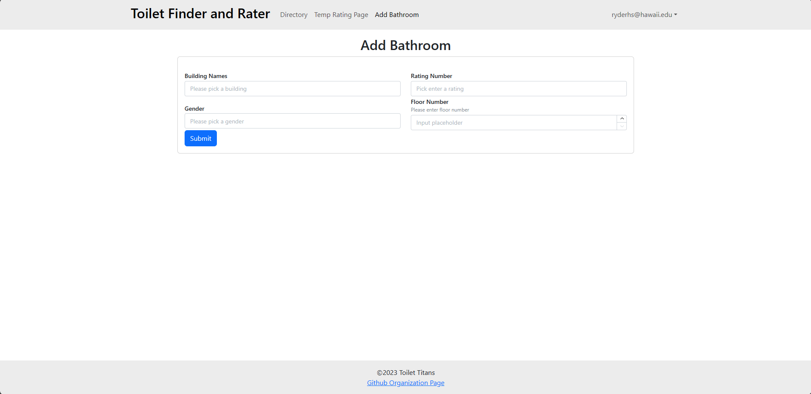

<small>
Authors:
Jianele Liu, Marques Batoon, Reyn Seki, Ryder Shintaku
</small>


## Overview 

Finding a toilet on campus that has a good clean to closeness ratio is always a lone struggle we studdents face each semester. We'd like to make this journey more collaborative by creating a social media web app where students are able to find nearest bathrooms to their location. 

The app will also allow students to rate a bathroom's cleanliness level and include things that others can be weary of. For example, the quality of soap in the bathroom, number of stalls, business at times of days, availability of female products, or if there are areas designated for users to place their belongings while using the premises.


## User Guide

After registering and signing in, users are able to gain access to the following content:
- **[Homepage](https://manoa-bathroom-finder.site/)**: A random bathroom of the day will be featured based on user ratings.
  
- **[Profile](https://manoa-bathroom-finder.site/profile)**: Each user will have their own profile page which will show their bathroom reviews.
  
- **[Bathroom Directory](https://manoa-bathroom-finder.site/directory)**: A user can find the highest rating bathrooms near their location by choosing a UH Manoa buildling within the directory. Time pending, we will implement an algorithm to find the nearest bathrooms to a user based on their location. Bathroom directories will be organized by building and floor number. If a building or bathroom is not on the directory, users are able to add their own to the database with a submission form which automatically updates database.
  
- **[Rating Page](https://manoa-bathroom-finder.site/rating)**: Each bathroom will have a page which shows all ratings and reviews by other students. On this page a user can rate a bathroom and input their own reviews which will automatically be added to the rating page.
  
- **[Add Bathroom Page](https://manoa-bathroom-finder.site/add-bathroom)**:A seperate way to add a bathroom if the user does not want to use the profile table.
  
  
## Community Feedback
Generally, people were not impressed with the website. But they did like the tables in the profile page and the Add Bathroom page. Some areas of improvement included the directory looking nicer, the home page being more professional and the directory being more organized.

### Installation

First, [install Meteor](https://www.meteor.com/install).

Second, visit the [Toilet-Titans application github page](https://github.com/toilet-titans/ToiletFinder), and click the "Use this template" button to create your own repository initialized with a copy of this application. Alternatively, you can download the sources as a zip file or make a fork of the repo.  However you do it, download a copy of the repo to your local computer.

Third, cd into the ToiletFinder/app directory and install libraries with:

```
$ meteor npm install
```

Fourth, run the system with:

```
$ meteor npm run start
```

If all goes well, the application will appear at [http://localhost:3000](http://localhost:3000).

### Application Design

ToiletFinder is based upon [meteor-application-template-react](https://ics-software-engineering.github.io/meteor-application-template-react/) and [meteor-example-form-react](https://ics-software-engineering.github.io/meteor-example-form-react/). Please use the videos and documentation at those sites to better acquaint yourself with the basic application design and form processing in Bowfolios.

## Test Cafe


## Milestones
- [M1](https://github.com/orgs/toilet-titans/projects/1) Site Design Draft
- [M2](https://github.com/orgs/toilet-titans/projects/2) Initialize Database and connect site to default bathroom database
- [M3](https://github.com/orgs/toilet-titans/projects/3) Make the site complete, improve QOL.

## Deployed Site
[Link](https://manoa-bathroom-finder.site/)

## Team Contract Link
[Google Docs](https://docs.google.com/document/d/14pBRniZ6KHrZOEJFxB_emzIQQTUT-btge485rYyElhs)


<!--
### Small image


### Large image


-->
